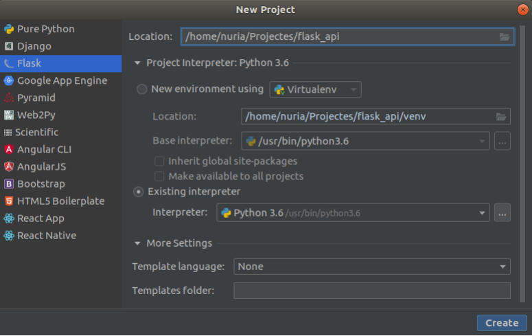

Sessió 1
=========

Instal·lació de Flask i la vostra primera aplicació de Flask
--------------------------------------------------

Flask és un paquet de Python addicional que hem d’instal·lar si volem
utilitzar-lo:

    pip install flask

A continuació, obriu PyCharm Editor i creeu un projecte Flask (*Flask\>New
Project*). Seleccioneu les opcions següents:



Si esteu familiaritzats amb el desenvolupament de Python i voleu crear un entorn propi per al Flask, podeu utilitzar virtualenv.

**No ho feu si mai no l'heu utilitzat abans**. 

**No utilitzeu el Flask d'Anaconda**

Després de la creació del projecte Flask, veureu que hi ha un fitxer anomenat `app.py`
i algunes carpetes que es creen per defecte dins el projecte (no utilitzarem aquestes carpetes en aquest moment):

```python
from flask import Flask

app = Flask(__name__)


@app.route('/')
def hello_world():
    return 'Hello World!'


if __name__ == '__main__':
    app.run()
```

Podeu executar aquesta aplicació executant Run al menú delPyCharm. Després d'això
podeu veure la vostra primera aplicació web Flask obrint aquest enllaç en
el vostre navegador web: <http://127.0.0.1:5000/>

També podeu executar-lo al terminal fent:

    python3 app.py

Mireu la línia de codi anterior: `app.route (’/’)`. Aquest decorador
indica en quina URL s'executarà la funció que va a continuació.

### Exercise 1: 

Afegeix aquest tros de codi a `app.py` després de la funció  `def hello_ world`:

```python
@app.route('/python')
def like_python():
    return 'I like Python!'
```

Torneu a executar l'aplicació i intenteu obrir l'URL corresponent a aquest nou missatge. Quina URL és? perquè?

Desenvolupament de la vostra primera API amb Flask
------------------------------------

Afegiu un fitxer nou al projecte anomenat `data.py` i copieu-hi el codi:

``` python
artists = [
    {'id': 0,
     'name': 'La Calòrica',
     'country': 'Spain',
     'disciplines': ['THEATRE']},
    {'id': 1,
     'name': 'Txarango',
     'country': 'Spain',
     'disciplines': ['MUSIC', 'CIRCUS']},
    {'id': 2,
     'name': 'Le Cirque du Soleil',
     'country': 'Canada',
     'disciplines': ['CIRCUS','MUSIC','THEATRE']},
    {'id': 3,
     'name': 'Dagoll Dagom',
     'country': 'Spain',
     'disciplines': ['MUSIC', 'THETRE','DANCE']}
]

places=[
{'id':0,
 'name': 'TNC',
 'city': 'Barcelona',
 'country': 'Spain',
 'capacity': 300
 },
 {'id':1,
 'name': 'Àgora',
 'city': 'Sant Joan de les Abadesses',
 'country': 'Spain',
 'capacity': 100
 },
]

shows = [
    {'id': 0,
     'name': 'De què parlem mentre no parlem de tota aquesta merda',
     'date': '2021-07-03',
     'place':[],
     'artist': []},
    {'id': 1,
     'name': 'El gran Circ',
   	  'date': '2021-07-04',
	  'place':[],
     'artist': []}
]
```
Com us podeu imaginar, aquesta serà la informació que mostrarà la nostra API.

Modifiqueu el fitxer `app.py` amb una línia per a importar aquestes dades a la nostra aplicació:

```python
from data import shows, artists, places
```

Modifiqueu també la línia `app.run()` amb la línia:

```python
app.run(port=5000, debug=True)
```

Amb aquesta línia forcem la nostra aplicació al port 5000 i indiquem que estem en mode  de depuració, cosa que significa que obtindrem més informació en cas que es produeixi algun error. Aquesta ordre s'hauria de modificar abans de desplegar la nostra aplicació.

### Exercici 2:

Afegiu dos URL nous al vostre `app.py` especificant que utilitzeu un GET HTTP
per a l'obtenció de les dades (afegiu aquesta opció `method = ['GET']` a
`@app.route` amb aquestes noves funcions):

- http://127.0.0.1:5000/artists: ha de tornar tots els artistes en format JSON
     (consell: `return  'artists': artists`).

- http://127.0.0.1:5000/shows: ha de tornar tot en format JSON
     mostra (es pot aplicar el mateix consell).

Proveu amb el paquet `requests` per validar que les dades retornades són les esperades.
El paquet `requests` us permeten enviar sol·licituds HTTP amb molta facilitat. Com a exemple podeu escriure això en una consola interactiva de python. 
```python
import requests
url = "YOUR_URL"
reponse = requests.get(url)
response.json()
```

D'altra banda, hi ha una altra coneguda eina per a comprovar les crides a http anomenada Postman, que ofereix una interfície d'usuari amigable amb la qual fer sol·licituds HTTP:

<https://www.postman.com/downloads/>


Desenvolupament d'APIs amb Flask-RESTful
----------------------------------

Flask-RESTful és una extensió per a Flask que afegeix suport per construir ràpidament API RESTful amb funcions especialitzades. Utilitzar Flask sol és una bona opció si només volem un framework web o una API molt bàsica
Es recomana l'ús de Flask-RESTFul per a APIs més complexes.

Abans de poder utilitzar Flask-RESTFul i les seves funcions, haureu d'instal·lar-lo:

    pip install flask_restful

La forma d'especificar URL i mètodes a Flask-RESTful és per classes anomenades `Resources`. Això sol correspondre amb una url (amb les seves variables d’entrada com veurem) i en cada recurs escrivim els diferents tipus de sol·licituds HTTP que necessitem en cada cas:

- GET: s’utilitza per sol·licitar informació

- POST: s’utilitza per afegir nous elements a la nostra estructura de dades

- DELETE: s'utilitza per eliminar elements de la nostra estructura de dades

- PUT: s’utilitza per modificar els elements existents a la nostra estructura de dades

Normalment, POST, DELETE i PUT només són utilitzats per gestors de dades especialitzats
i no estan disponibles sense permisos. Això evita persones desconegudes de modificar les nostres dades.

### Fent servir l'estructura Resource

Vegem aquesta estructura de recursos de classe en el nou fitxer `app.py`:

```python
from flask import Flask
from flask_restful import Resource, Api
from data import artists, events

app = Flask(__name__)
api = Api(app)


class Artist(Resource):

    def get(self, id):
        return {'message': "Not developed yet"}, 404

    def post(self, id):
        return {'message': "Not developed yet"}, 404

    def delete(self,id):
        return {'message': "Not developed yet"}, 404

    def put(self,id):
        return {'message': "Not developed yet"}, 404

api.add_resource(Artist, '/artist/<int:id>')

if __name__ == '__main__':
    app.run(port=5000, debug=True)
```

Tingueu en compte que ara la nostra aplicació està vinculada a `flask_restful` i a les seves funcionalitats extres mitjançant: `api = Api(app)`.

Tingueu en compte també que ara els nostres URL (també coneguts com a punts finals o endpoints) s’especifiquen d’aquesta manera:

     api.add_resource(Artist, '/artist/<int:id>') 

La part `’/artist/<int:id>’` indica que prendrem un valor enter com a entrada als nostres mètodes de recursos.

Així doncs, una URL vàlida que anomeni aquest recurs hauria de tenir aquest format: `http: //127.0.0.1:5000/artist/0`. El tipus de sol·licitud determinarà el tipus d’acció que volem realitzar amb les nostres dades.

Com podeu veure retornem un valor 404 corresponent a un error de sol·licitud http "No trobat" que indica que aquesta opció no està disponible. Després de desenvolupar aquests mètodes, també hauríem de tornar el valor 200 si tot està bé o 400 (o similiar) si es produeix algun problema. També es poden enviar missatges que ajudin a obtenir més informació sobre possibles problemes.

Si voleu més informació sobre els codis de resposta Http, podeu trobar més informació en aquesta pàgina web (secció *Codis d’estat de la resposta HTTP*):

<https://developer.mozilla.org/en-US/docs/Web/HTTP/Methods>


### Com gestionar les vostres dades amb python

Abans de mostrar-vos com desenvolupar els mètodes de les classes anteriors, anem a fer una ullada a Python Console fent alguns exercicis relacionats amb la nostra gestió de dades.
Obriu la consola Python al nostre directori del projecte (la mateixa carpeta que `data.py`) i importeu les dades:

	>>>  from data import artists, places, shows

Fixeu-vos els continguts d' artists, shows i places:

	>>> artists
	>>> shows
	>>> places
	
Fixeu-vos que són llistes, i cada element és un diccionari.
	
	>>> type(artists)
	>>> artists[1:3] 


Podem recórrer una llista per trobar la informació desitjada. Per exemple, torneu una llista nova amb tots els artistes d’Espanya:

	>>> [x for x in artists if x["country"]=='Spain']
	

Retornar un artista pel seu id:

	>>> id = 3
	>>> artist = iter([x for x in artists if x["id"]==id])
	>>> next(artist,None)

O retornar artistes d'una disciplina concreta:

	>>> [x for x in artists if "MUSIC" in x["disciplines"]]


Podeu afegir o eliminar elements d'una llista mitjantçant les funcions append o pop:

És important entendre que en aquest moment no fem servir persistència de dades i que si tanqueu Python Console quan la torneu a obrir, totes les modificacions que hàgiu fet a les vostres dades desapareixeran.

També és important saber que podeu afegir qualsevol cosa a les llistes de dades. Depèn de vosaltres afegir la informació nova amb el format correcte.


Obteniu un artista pel seu identificador (exemple GET)
----------------------------------------

Ara que enteneu la nostra estructura de dades i com fer una tasca senzilla, és hora d'escriure el mètode  `def get(self,id)` a `Artist`.

Com us podeu imaginar, només hem de buscar un artista pel seu identificador i retornar-lo. Simplement empleneu aquest mètode com els exemples anteriors:

```python
def get(self, id):
    artist = next(iter([x for x in artists if x["id"]==id]), None)
    return {'artist': artist}, 200 if artist else 404
```

### Exercici 3: 

Proveu de comprovar que el mètode get retorna la informació esperada mitjançant *requests* o un altre tipus de testejador d'API.

Afegir un artista a la llista d'artistes (exemple POST)
--------------------------------------------

Ara implementarem el mètode POST (`def post(self, id)`) que utilitzarem per afegir un artista nou a les nostres dades (a la nostra llista d'artistes). És important entendre que la nova informació de l’artista s’inclourà al cos de sol·licitud POST i que hem d’obtenir aquestes dades mitjançant `reqparse`.


```python
from flask_restful import Resource, Api, reqparse #add reqparse to imports
```

```python
parser = reqparse.RequestParser() #create parameters parser from request

#define all input parameters need and its type

parser.add_argument('name', type=str, required = True, help = "This field cannot be left blanck")
parser.add_argument('country', type = str)
parser.add_argument('discipline', type = str, action="append") #action = "append" is needed to determine that is a list of strings

data = parser.parse_args()
```

Aquesta variable `data` contindrà totes les dades que s'han enviat pel request, podem obtenir els seus valors amb:
data['name'], data['country'], etc.

Usant aquest codi, feun una nova variable `new_artist` i afegiu-la a la llisa d'artistes.  
Però primer comproveu si ja existeix un artista amb aquest identificador. Si hi ha un altre artista amb el mateix identificador, envieu un missatge amb informació sobre aquest problema i un codi d'error:

    {'message': "Artist with id [{}] Not found".format(id)} 

En cas contrari, afegiu l'artista, torneu l'artista afegit i el codi OK.

### Exercici 4: 

Proveu el mètodo post fent servir `requests` o una altra eina per fer tests d'APIs tot afegint la següent informació al cos del request:

``` html
{
    "name": "Ballet Nacional Rus",
    "country": "Rússia",
    "disciplines": ["DANCE"]
}
```

Recordeu que el paràmetre id prové de la pròpia URL.

Deures per a la propera setmana
--------

1. Afegiu al mètode POST l'opció per afegir un artista nou sense especificar cap identificador. En aquest cas, li donarem com a  identificador l'id màxim de la llista +1. (Consell: modifiqueu el vostre codi amb:)

    ```python
    def post(self, id=None):
    ```

    ```python
    api.add_resource(Artist, '/artist/<int:id>', '/artist')
    ```

    Feu el comportament anterior o aquest segons si existeix o no el paràmetre id.
    
2.  Escriviu el mètode DELETE que amb un identificador elimini un artista de la llista d'artistes. Torneu un missatge indicant si aquest usuari s'ha suprimit o no i el codi corresponent.

3. Escriviu el mètode PUT que, si no existeix aquest identificador, creeu un artista nou i afegiu-lo a la llista d'artistes. En cas contrari, modifiqueu els valors de l'artista amb aquest identificador amb la informació del cos de la  sol·licitud del put. Retorna l'artista creat o modificat.


4.  Escriviu els mètodes GET, POST, DELETE i PUT per a un recurs anomenat Place amb la URL:

        '/place/<int:id>'

5.  Escriviu els mètodes GET, POST, DELETE i PUT per a un recurs anomenat Show amb la URL:

        '/show/<int:id>'

  Creeu els espectacles nous amb les llistes d'artistes i de llocs buides.
    
6.  Creeu tres recursos nous: ArtistList, PlaceList i ShowList amb un mètode capaç de mostrar tota la informació d'artistes i espectacles en les URLs `artists`, `places` i `shows`.

7.  Proveu i comproveu tots els mètodes desenvolupats amb `requests` o una altra eina de prova d'APIs.